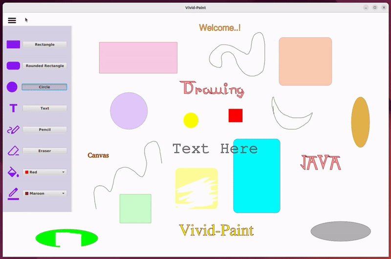

# VividPaint Drawing Tool 🎨
VividPaint is a simple yet powerful 2D drawing application built using JavaFX. This application allows users to draw a variety of shapes, add text, change colors, and much more. It comes with a dynamic drawing toolbar with various customizable options for a rich drawing experience.

### Features
- **Diverse Shape Drawing**: Draw rectangles, rounded rectangles, squares, rounded squares, circles, and ellipses with customizable fill and stroke colors.
- **Dynamic Color Control**: Independently apply fill and stroke colors for shapes, text and pencil drawings to create vibrant artwork.
- **Freehand Drawing**: Unleash your inner artist with the powerful pencil tool, offering various colors to explore.
- **Erasure Control**: Precisely remove unwanted parts of the drawing using the eraser tool with adjustable size for clean-up tasks.
- **Text Creation**: Input text with a wide range of font families and sizes to suit your artistic vision.
- **Text Styling**: Further customize your text by changing its stroke and fill colors to create stunning effects.
- **Intuitive Interface**: Provide a well-designed collapsible drawing toolbar with easy-to-use controls for a smooth workflow.


### Technologies Used
- **JavaFX**: Provides the foundation for building this cross-platform drawing application.
- **JFoenix Library**: Enhances the graphical user interface for a modern and visually appealing look.


### Installation & Running the Application

1. **Prerequisites**: Ensure you have Java (JDK 11 or later) and the required dependencies (JavaFX, JFoenix) installed on your system. A build tool like Maven or Gradle is optional but recommended for building from source.
<br><br>

2. **Building from Source**:
   - Clone the repository:
     ```bash
     git clone https://github.com/Pebhashi-Tharushika/vividpaint-drawing-tool.git
     ```
   - Navigate to the project directory:
     ```bash
     cd VividPaint-Drawing-Tool
     ```
   - Build the project using either Maven or Gradle:

     For **Maven**:
     ```bash
     mvn clean install
     ```
     For **Gradle**:
     ```bash
     gradle build
     ```

     This will create the executable JAR file in the `target` (Maven) or `build/libs` (Gradle) directory.
<br><br>

3. **Running the Application**: 

   Navigate to the JAR file location. Double-click the JAR file to launch VividPaint. Alternatively, you can run it from the command line:

   ```bash
   java -jar vividpaint-drawing-tool-1.0.0.jar


### Usage
Drawing Tools:
- Select the desired shape or tool (pencil, eraser etc.) from the dedicated toolbar
- Click and drag on the canvas to draw shapes.
- Adjust the eraser size to erase parts of the drawing.

Color Management:
- Click on the color pickers to choose fill and stroke colors for shapes and text.
- Use the available sliders or input color values directly for precise color control.

Text Addition:
- Click the text tool button and click on desired location of the canvas to insert a text box.
- Enter your desired text and customize its font family, size, fill color and stroke color within the provided options.

### Application Preview
 
 
 



### Contributing
Contributions are welcome! If you'd like to contribute, please fork the repository and create a pull request.


### License
Copyright 2023 MBPT. All Rights Reserved.
This project is licensed under the [MIT License](LICENSE) - see the LICENSE file for details.